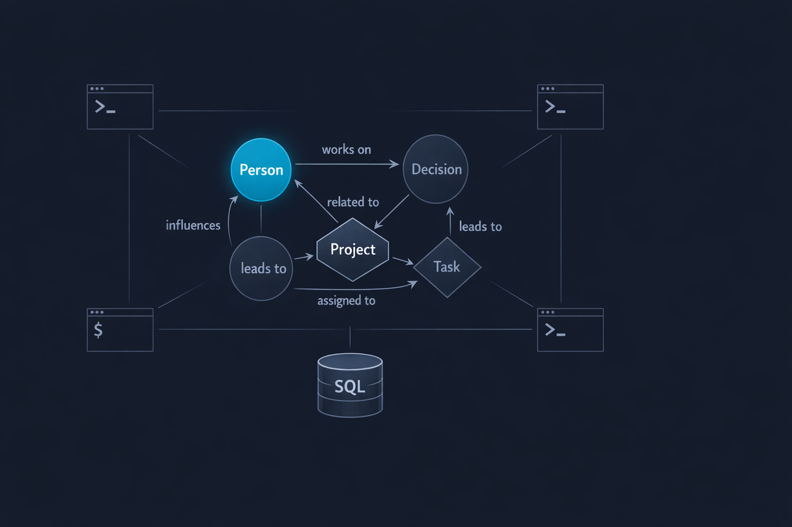

# mcp-memory

[](https://github.com/marlian/mcp-memory/actions/workflows/ci.yml)
[](https://github.com/marlian/mcp-memory/releases/latest)
[](LICENSE)



**The same memory, everywhere you work.**

mcp-memory is a local SQLite knowledge graph with opinionated retrieval, cognitive decay, and zero infrastructure. Attach it to Claude Code, Codex, Gemini CLI, Cursor, VS Code, or any MCP-compatible client — your entities, observations, and relations are always there, identically.

Switch providers tomorrow. Your memory stays.

**This is deliberately not an agent, planner, or orchestration layer.** It stores facts and retrieves them intelligently. Composite ranking, cognitive decay, and multi-channel search happen in the backend — the model doesn't have to think about memory while doing actual work.

## Features

- **Provider-agnostic** — one config entry, any MCP client. Claude, Codex, Gemini, Cursor, VS Code Copilot, Kilo, Roo Code, Cline: all see the same memory, same tools, same workflow
- **Composite relevance ranking** — multi-channel retrieval scored across FTS position, cognitive decay, and access frequency. The backend chooses what's relevant — the model just asks
- **Cognitive decay** — facts fade over time unless recalled. Frequently accessed facts build stability and resist decay; stale ones naturally sink
- **Knowledge graph** — entities, observations, and named relations with full-text search across all stored facts
- **Event grouping** — bundle related observations under sessions, meetings, or decisions for coherent recall
- **Provenance primitives** — fetch observations directly by ID or event, without running a new search
- **Soft delete** — `forget` tombstones facts rather than destroying them. Deleted rows are excluded from all retrieval but remain in the database (recoverable via direct SQLite access if needed)
- **Project-scoped memory** — one server, many workspaces. Each project gets its own isolated database, created lazily on first use
- **Opt-in telemetry** — [usage analytics](docs/telemetry.md) with client identity, tool call timing, and search ranking metrics. Separate SQLite DB, zero overhead when disabled
- **Zero infrastructure** — no external database, no API keys, no server to manage. A single Node.js process, a local SQLite file
- **Duplicate detection** — identical observations are silently deduplicated
- **Direct stdio** — wire it straight into your client's JSON config. No wrapper, no proxy

## Quick start

```bash
git clone https://github.com/marlian/mcp-memory.git
cd mcp-memory
npm install
```

Want to pin to a stable version instead of tracking `main`?

```bash
git clone --branch v0.6.0 https://github.com/marlian/mcp-memory.git
```

See [releases](https://github.com/marlian/mcp-memory/releases) for version history.

Then add it to your AI client's MCP configuration (see below).

## Client configuration

mcp-memory communicates over **stdio** — the client spawns it as a child process. No ports, no HTTP. Just add the server entry to your client's config file.

### Claude Desktop

Edit `~/Library/Application Support/Claude/claude_desktop_config.json` (macOS) or `%APPDATA%\Claude\claude_desktop_config.json` (Windows):

```json
{
  "mcpServers": {
    "memory": {
      "command": "node",
      "args": ["/absolute/path/to/mcp-memory/server.js"]
    }
  }
}
```

### Claude Code

Add to your project's `.claude/settings.json` or global `~/.claude/settings.json`:

```json
{
  "mcpServers": {
    "memory": {
      "command": "node",
      "args": ["/absolute/path/to/mcp-memory/server.js"]
    }
  }
}
```

### VS Code / Cursor

Add to `.vscode/mcp.json` in your workspace:

```json
{
  "servers": {
    "memory": {
      "command": "node",
      "args": ["/absolute/path/to/mcp-memory/server.js"]
    }
  }
}
```

### Windsurf

Add to `~/.codeium/windsurf/mcp_config.json`:

```json
{
  "mcpServers": {
    "memory": {
      "command": "node",
      "args": ["/absolute/path/to/mcp-memory/server.js"]
    }
  }
}
```

### Any MCP client

The server speaks MCP over stdio. The spawn command is:

```bash
node /absolute/path/to/mcp-memory/server.js
```

No arguments required. Configuration is optional and uses environment variables — see [Environment variables](#environment-variables) for the full list and the three ways to provide values, with defaults applying if none are provided.

## How project-scoped memory works

This is the key architectural feature. A single server instance manages both **global** memory and **per-project** memory through one mechanism: the `project` parameter.

### Without `project` — global memory

```
remember({ entity: "Bob", observation: "prefers dark mode" })
```

Stored in the server's own directory: `<mcp-memory>/memory.db`

This is for cross-project knowledge: user preferences, tool configurations, general facts.

### With `project` — workspace-scoped memory

```
remember({ entity: "API", observation: "rate limit is 100/min", project: "~/my-app" })
```

Stored inside the project: `~/my-app/.memory/memory.db`

The database is **created lazily** — it doesn't exist until the first `remember` call with that project path. After that, all tools called with the same `project` parameter read and write to that project's isolated database.

### The mental model

```
                    ┌─────────────────────────┐
                    │     mcp-memory server    │
                    │    (single process)      │
                    └────────┬────────────────┘
                             │
              ┌──────────────┼──────────────┐
              │              │              │
              ▼              ▼              ▼
      ┌──────────┐   ┌──────────┐   ┌──────────┐
      │ memory.db│   │.memory/  │   │.memory/  │
      │ (global) │   │memory.db │   │memory.db │
      └──────────┘   └──────────┘   └──────────┘
       server dir     ~/project-a    ~/project-b
```

- One server process, multiple SQLite databases
- Global DB lives next to `server.js`
- Project DBs live inside each workspace at `.memory/memory.db`
- Each DB is fully independent — its own entities, observations, relations, events
- Databases are opened on first access and cached in memory for the session
- The `project` parameter accepts absolute paths or paths relative to `~`

**Add `.memory/` to your `.gitignore`** — you don't want to commit the database.

### Decay rates

Project memory decays slower than global memory by default, because project knowledge tends to stay relevant longer:

| Scope | Default half-life | Env var |
|-------|------------------|---------|
| Global | 12 weeks | `MEMORY_HALF_LIFE_WEEKS` |
| Project | 52 weeks | `PROJECT_MEMORY_HALF_LIFE_WEEKS` |

## Running multiple instances

You can run separate server instances for different purposes. A common pattern is one for general knowledge and one for private/personal notes. The client sees them as separate tool namespaces (`memory__remember` vs `private_memory__remember`), which helps the model keep the two stores cleanly separated.

There are two ways to do it. Pick the one that matches your workflow.

### Pattern A — one clone, differentiated in the client config

Use the client's MCP `env` block to override variables per instance. Same `server.js` spawned twice, two different databases:

```json
{
  "mcpServers": {
    "memory": {
      "command": "node",
      "args": ["/path/to/mcp-memory/server.js"]
    },
    "private_memory": {
      "command": "node",
      "args": ["/path/to/mcp-memory/server.js"],
      "env": {
        "MEMORY_DB_PATH": "/path/to/private/memory.db",
        "MEMORY_HALF_LIFE_WEEKS": "26"
      }
    }
  }
}
```

Simple, single codebase, all configuration in one place. **This is the default pattern** and works with every MCP client that supports an `env` block.

### Pattern B — two clones, each with its own `.env`

Useful when your client's MCP schema rejects `env` blocks (Kilo is one such client today), or when you simply want each instance to be fully self-contained. Clone the repo twice and put a local `.env` file next to each `server.js`:

```
~/mcp-memory-general/
  server.js
  .env                       # MEMORY_HALF_LIFE_WEEKS=12
  memory.db                  # created on first use

~/mcp-memory-private/
  server.js
  .env                       # MEMORY_HALF_LIFE_WEEKS=26
  memory.db                  # created on first use
```

Client config becomes trivial:

```json
{
  "mcpServers": {
    "memory": {
      "command": "node",
      "args": ["/path/to/mcp-memory-general/server.js"]
    },
    "private_memory": {
      "command": "node",
      "args": ["/path/to/mcp-memory-private/server.js"]
    }
  }
}
```

Each clone is a self-contained deployment. `git pull` in either clone to update the code; the `.env` and `memory.db` stay local. This pattern also plays well with tool description customization (see [below](#customizing-tool-description-examples)).

**Note:** `.env` files are gitignored by default so your local configuration never ends up in a commit.

## Recommended LLM instructions

For the model to use memory effectively, it needs guidance on _when_ and _how_ to use the tools. Add this to your system prompt, `CLAUDE.md`, `.cursorrules`, or equivalent:

```markdown
## Persistent Memory

You have access to a persistent memory store. Use it proactively:

- **`remember`** — store facts about entities (people, projects, tools, decisions).
  One atomic fact per call.
- **`remember_batch`** — store multiple facts at once
- **`remember_event`** — group related observations under a session, meeting, or
  decision. Create the event first, then attach observations via `event_id`
- **`recall`** — search memory by free text. Costs nothing (local SQLite query).
  Do this liberally when you need context
- **`recall_entity`** — get everything about a specific entity
- **`recall_events`** — find events by label, type, or date range
- **`recall_event`** — get a full event with all its grouped observations
- **`relate`** — link two entities with a named relationship
- **`forget`** — tombstone stale or incorrect facts (soft delete — excluded from retrieval)
- **`list_entities`** — browse what's in memory
- **`get_observations`** — fetch specific observations by ID (provenance hydration)
- **`get_event_observations`** — fetch raw observations for a known event ID

### When to remember

- User preferences and corrections ("no, we use Bun not Node")
- Names, roles, relationships
- Architectural decisions and project conventions
- Recurring patterns worth retaining across sessions
- If the user corrects you, that correction is a fact worth storing

### When to use events

When 3+ related facts belong to the same moment — a meeting, a debugging
session, a decision point. Create the event first with `remember_event`,
then reference its `event_id` in subsequent `remember` calls.

### When NOT to remember

Transient task details, code snippets, anything already in docs or git.
Memory is for knowledge that lives between sessions, not within one.

### Project-scoped memory

Pass the `project` parameter to scope memory to a specific workspace:

    remember({ entity: "API", observation: "Uses REST not gRPC", project: "/path/to/repo" })
    recall({ query: "API design", project: "/path/to/repo" })

The project database is created lazily at `<project>/.memory/memory.db`.
Add `.memory/` to your `.gitignore`.

Use project-scoped memory for architecture decisions, local conventions,
and project-specific knowledge. Use global memory (no `project` param)
for cross-project preferences and general facts.
```

## Cognitive decay

Facts don't live forever. mcp-memory implements a decay model inspired by human memory:

**Base formula:**

```
effective_confidence = confidence * 0.5 ^ (age_weeks / stability)
```

**Stability** grows with access:

```
stability = half_life * (1 + log2(access_count + 1))
```

This means:
- A fact recalled 0 times has stability equal to the half-life (12 weeks by default)
- A fact recalled 3 times has stability of 24 weeks (2x)
- A fact recalled 7 times has stability of 36 weeks (3x)
- Frequently recalled facts resist decay; forgotten facts fade naturally

Decay is computed at **read time** — no background jobs, no cron. The database stores raw confidence and access counts; the effective confidence is calculated when you `recall`.

## Tools reference

| Tool | Required params | Optional params | Description |
|------|----------------|-----------------|-------------|
| `remember` | `entity`, `observation` | `entity_type`, `source`, `confidence`, `event_id`, `project` | Store a fact about an entity |
| `remember_batch` | `facts[]` | `project` | Store multiple facts at once |
| `recall` | `query` | `limit`, `compact`, `project` | Search memory by free text. `compact: true` returns truncated snippets — expand with `get_observations` |
| `recall_entity` | `entity` | `project` | Get everything about an entity |
| `relate` | `from`, `to`, `relation_type` | `context`, `project` | Link two entities |
| `forget` | — | `observation_id`, `entity`, `project` | Remove a fact or entity |
| `list_entities` | — | `entity_type`, `limit`, `project` | Browse stored entities |
| `remember_event` | `label` | `event_date`, `event_type`, `context`, `expires_at`, `observations[]`, `project` | Create an event with optional observations |
| `recall_events` | — | `query`, `event_type`, `date_from`, `date_to`, `limit`, `project` | Search events |
| `recall_event` | `event_id` | `project` | Get full event with all observations |
| `get_observations` | `observation_ids[]` | `project` | Fetch observations directly by ID — hydrate provenance without a new search |
| `get_event_observations` | `event_id` | `project` | Fetch raw observations for a known event, without the full `recall_event` envelope |

## Environment variables

| Variable | Default | Description |
|----------|---------|-------------|
| `MEMORY_DB_PATH` | `./memory.db` | Path to the global SQLite database |
| `MEMORY_HALF_LIFE_WEEKS` | `12` | Decay half-life for global memory (weeks) |
| `PROJECT_MEMORY_HALF_LIFE_WEEKS` | `52` | Decay half-life for project-scoped memory (weeks) |
| `COMPACT_SNIPPET_LENGTH` | `120` | Max chars per observation when `recall` is called with `compact: true` |
| `MEMORY_TELEMETRY_PATH` | *(disabled)* | Path to telemetry SQLite DB. When set, logs tool calls, timing, and search metrics. See [docs/telemetry.md](docs/telemetry.md) |

### How to set them

There are three external configuration sources. The server reads them with this precedence, **highest to lowest**, with hardcoded defaults applying when none are provided:

1. **Client MCP config `env` block** — values set by the client when spawning the server (see [Pattern A](#pattern-a--one-clone-differentiated-in-the-client-config) above).
2. **Shell environment** — variables exported in the parent process that spawns the client.
3. **`.env` file** — optional file located next to `server.js`, loaded automatically at startup. Any variable already set via method 1 or 2 is preserved; `.env` only fills in values not set elsewhere.
4. **Hardcoded defaults** — if none of the above provides a value, the defaults in the table above apply.

This precedence means you can use a `.env` file for deployment-level defaults and still override individual values from the client when needed.

### The `.env` file

Copy the template and edit:

```bash
cp .env.example .env
```

Supported syntax:

```bash
# Comments on their own line
KEY=value                           # simple assignment
KEY="value with spaces"             # double quotes
KEY='value with spaces'             # single quotes
KEY=value # trailing comment        # inline comment (unquoted values)
KEY="value # literal hash"          # hash is literal inside quotes
export KEY=value                    # bash export prefix is allowed
KEY=                                # empty string (POSIX: var exists)
```

Not supported (by design — use the client config or shell for these):

- Variable interpolation (`${OTHER_VAR}`)
- Multi-line values
- Escape sequences inside quotes

The parser is intentionally minimal. If you need advanced features, set the variable through your shell or client config — both take precedence over `.env`.

## Customizing tool description examples

Tool descriptions shown to the model include example values to guide its usage (e.g. `entity: "Alice", "ProjectX", "React"`). The defaults are intentionally generic.

If your deployment has a specific domain — a team's jargon, a personal knowledge base, a project with its own vocabulary — you can override these examples by creating an `examples.json` file next to `server.js`:

```bash
cp examples.json.example examples.json
```

Then edit the arrays. Any key you omit falls back to the default:

```json
{
  "entities": ["your", "example", "entities"],
  "entity_types": ["your", "types"],
  "relations": ["your_verbs", "here"],
  "event_labels": ["Your event labels"],
  "event_types": ["your", "event", "types"]
}
```

The file is loaded once at startup. Restart the server to apply changes. `examples.json` is gitignored so each clone can have its own customization without polluting the repo.

**Why this matters:** models pay attention to examples in tool descriptions. Tailoring them to actual usage in your deployment often produces noticeably better tool-use decisions than generic placeholders.

## Database

SQLite with WAL mode enabled. The schema is created automatically on first run. Tables:

- **entities** — named things (people, projects, tools, concepts)
- **observations** — atomic facts linked to entities, with confidence and access tracking
- **relations** — directed links between entities (e.g. "Alice works_with Bob")
- **events** — temporal groupings (meetings, sessions, decisions) with optional expiry
- **memory_fts** — FTS5 virtual table for full-text search

No migrations needed — the server handles schema creation and upgrades automatically.

### Soft delete

`forget` tombstones entities and observations (`deleted_at` timestamp) rather than destroying them. Tombstoned rows are excluded from all retrieval and listing flows. Relations are hard-deleted when an entity is forgotten. The FTS index is updated synchronously on forget so deleted facts disappear from search immediately.

## License

MIT — see [LICENSE](LICENSE) for the full text.
